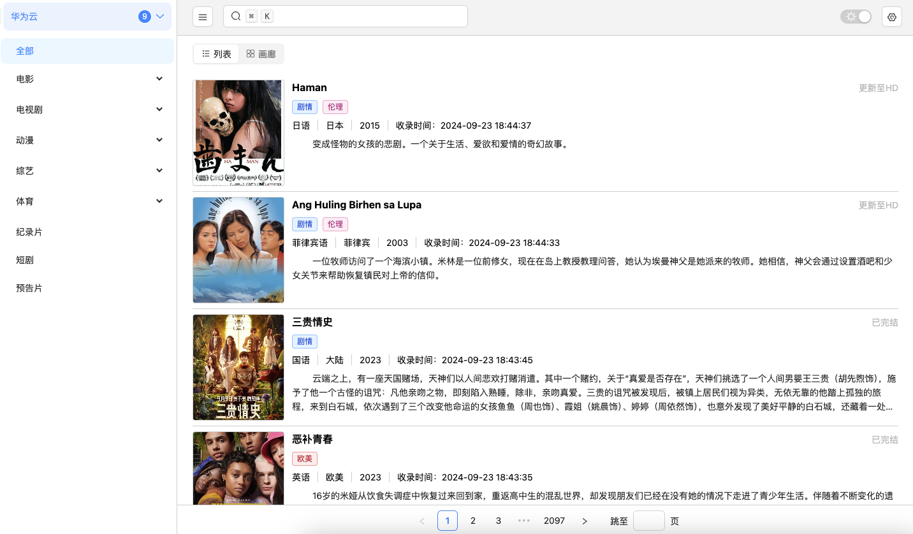
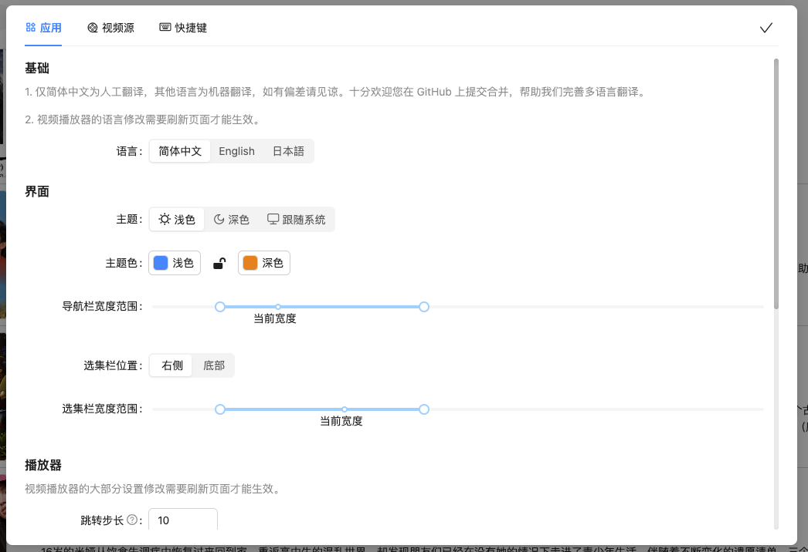

# 光影畅享

[English](./README.md) | 简体中文

---

「光影畅享」是一个在线视频播放器，支持 Web 网页和 Windows、Mac、Linux 桌面应用。主要用于 CMS 视频采集站资源的在线浏览，实现了 HLS 视频流（m3u8）的在线播放。

## 特性

- 实现了 Web 网页和 Windows、Mac、Linux 桌面应用
- 只需要一个 URL，就可以导入 CMS 视频采集站资源
- 支持多语言（i18n）
- 提供了丰富的设置，如界面设置、播放器设置等
- 支持数据备份与还原
- 为常用功能提供了键盘快捷键

## 待办

- [ ] 历史播放记录
- [ ] 搜索记录
- [ ] 收藏功能
- [ ] XML 格式数据支持
- [ ] m3u8 直播源支持
- [x] 导出/导入/重置设置和播放源
- [x] 拖入文件或粘贴导入设置和播放源

## 截图






## 使用

### 桌面应用

请到 [releases](https://github.com/xurenda/enjoy-player/releases) 页面下载最新版本，支持 Windows、Mac、Linux

### Web 网页

```sh
git clone https://github.com/xurenda/enjoy-player.git
cd enjoy-player
pnpm install
pnpm run dev:web
```

> 建议使用桌面应用，因为 Web 端可能存在跨域请求无法拿到数据的问题

## 视频源

1. 搜索引擎搜索“CMS 视频资源站”
2. 进入某个视频资源站后，查看采集教程，复制 JSON 接口 URL 地址

## 参考项目

- [h-player-v2](https://github.com/ZyqGitHub1/h-player-v2)
